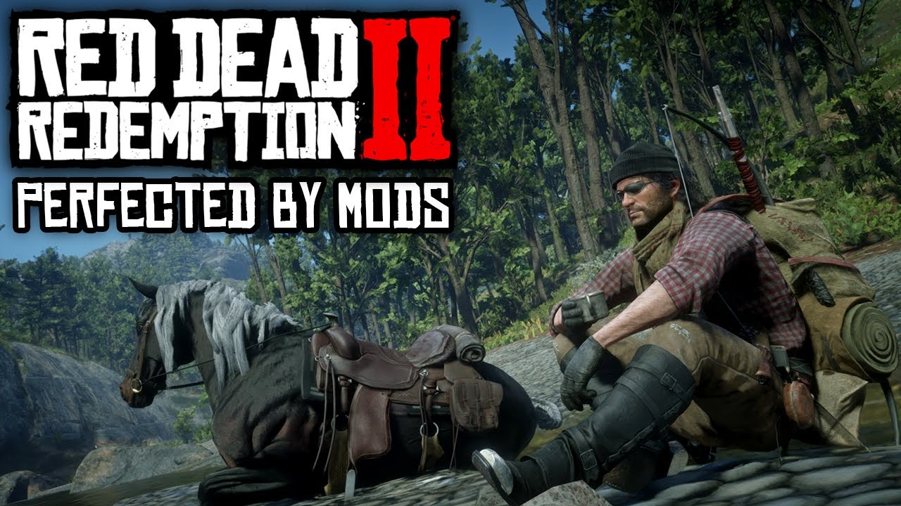

# RDR2 Cheats Installation Guide

This guide explains how to install **Script Hook RDR2** for Red Dead Redemption 2. Follow the steps below to enhance your game experience.

---

## 1. Installing Script Hook RDR2
### Required Files:
- `ScriptHookRDR2_1.0.1491.1.zip` or your current version.

### Installation Steps:
1. Extract the **Script Hook RDR2** archive.
2. Select the following files:
   - `ScriptHookRDR2.dll`
   - `dinput8.dll` (this is required for the ASI loader).
3. Copy these files to the main game directory where `RDR2.exe` is located.

---

### Mod Install Guides

- [Auto Loot](guide/AutoLoot.md)
- [Rampage Mod Menu](guide/Rampage.md)

---

## 2. Launching the Game
1. Start the game normally through the **Rockstar Launcher**.
2. If installed correctly, the Script Hook functionality will be active in the game.

---

## 3. Important Notes
- **Do not use cheats or mods in Online Mode!** This may result in your account being **banned**.
- Always back up your game files before installing mods or cheats.
- Use cheats and mods only for **Story Mode**.

---

## 4. Troubleshooting
If the cheats do not work:
- Verify that the files are placed in the correct directory.
- Ensure the version of the mod matches your game version.
- Check the log files for potential errors.

---

With these steps, you can safely enjoy your enhanced game experience in **Story Mode**. Have fun and game on! 🎮

---

## Issues and Feedback

Have you found a bug or want to suggest an improvement? Please let us know by opening an issue:

- [Open an Issue](https://github.com/jasurhaydarovcode/RDR2-CHEATS-PACK/issues)

**How to Report an Issue:**
1. Provide a clear and concise description of the issue.
2. Include steps to reproduce the problem.
3. Attach screenshots or logs if applicable.

We appreciate your feedback to improve this guide. 😊

---

Enjoy modding and have fun in RDR2! 🎮